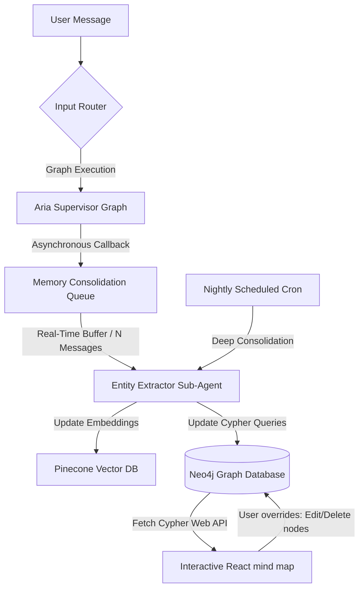
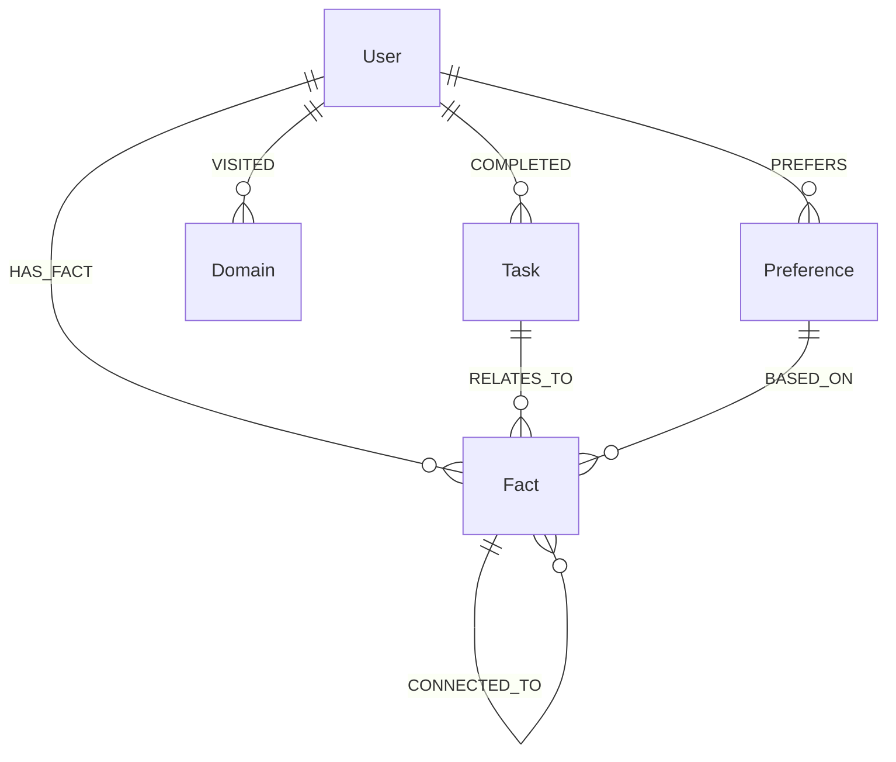
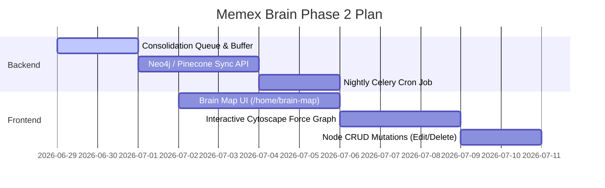

# Memex Brain Personalization: Hybrid Vector-Graph Memory System

This document outlines the architectural plan for making this agent the **next big thing in AI personalization (2026)** by constructing a self-evolving, interactive, hybrid Vector-Graph memory system. 

It covers how the agent dynamically extracts facts, updates its vector embeddings and knowledge graph, handles contradictions, and presents an interactive visualization of the user's growing mind graph in Neo4j.

---

## 1. Architectural Overview

The agent's memory operates as a **Dual-Lens Retrieval System**:
1. **Semantic Memory (Vector DB - Pinecone):** Captures conceptual similarity, raw context, and broad search matches.
2. **Relational Memory (Knowledge Graph - Neo4j):** Captures precise facts, explicit preferences, entity connections, and multi-hop relationships.



---

## 2. Dynamic Memory Extraction & Pipeline Triggers

Memory updates must run in the background to ensure **zero latency impact** on chat response times. We implement three triggers:

### A. Real-Time Event Trigger (Buffer Queue)
* **How:** After each conversation turn completes, the server inspects the message pair. If the supervisor detects explicit personal data or instruction changes, it pushes the turn transcript to an in-memory queue.
* **Buffer Processing:** Once the queue reaches a size of $N = 3$ messages (or if the user changes settings), a background worker pulls the turns, runs the `entity_extractor` LLM to pull out structured facts, and updates both databases.

### B. Nightly Scheduled Cron Job (Deep Consolidation)
* **How:** Triggered daily via a Celery Beat/Redis task (e.g., at 3:00 AM).
* **Process:** 
  1. Scrapes the last 24 hours of browser domain logs, finished tasks, and chat transcripts.
  2. Runs a summarization LLM to extract high-level patterns (e.g., *"User spent 4 hours on Next.js docs and finished 3 tasks relating to Convex auth"*).
  3. Inserts structural nodes and relationship edges into Neo4j and indexes the summaries in Pinecone.

### C. Self-Healing Contradiction Resolver
When new facts are extracted, they are cross-referenced with the existing Neo4j graph.
* **Rule-Based Conflicts:** If a new node states `(:User)-[:LOCATED_IN]->(Paris)` and the graph contains `(:User)-[:LOCATED_IN]->(London)`, the system runs a resolution step.
* **Resolution:** It updates the old relationship to `[:WAS_LOCATED_IN]` or deletes it, archiving the old fact to maintain database consistency.

---

## 3. Knowledge Graph Schema (Neo4j)

A flexible, strongly-typed schema to store the user's growing ecosystem:



### Node Types & Properties
* **`User`**
  * `id`: Clerk User ID (string)
  * `name`: User's name (string)
* **`Fact`**
  * `text`: The factual statement (string) - *e.g., "Ronit is working on a Next.js hackathon project."*
  * `confidence`: Weight 0.0 - 1.0 (float)
  * `lastUpdated`: Epoch Milliseconds (number)
* **`Preference`**
  * `topic`: Topic name (string) - *e.g., "Styling"*
  * `value`: Value (string) - *e.g., "Prefers Vanilla CSS over TailwindCSS"*
* **`Domain`**
  * `name`: Domain URL (string)
  * `totalTimeSpentMs`: Duration (number)

---

## 4. Dual-Lens RAG Retrieval Strategy

When the supervisor node receives a message, it runs a hybrid search:

1. **Semantic Retrieval:** 
   * Embeds the user query and searches Pinecone.
   * Returns the top 5 semantic context snippets.
2. **Graph Traversals:**
   * Extracts entity keywords from the query.
   * Runs a Cypher query to retrieve:
     * Adjacent preference nodes: `MATCH (u:User {id: $uid})-[:PREFERS]->(p) RETURN p`
     * 2-hop connected facts: `MATCH (u:User {id: $uid})-[:HAS_FACT]->(f1)-[:CONNECTED_TO*0..1]-(f2) RETURN f1, f2`
3. **Context Construction:**
   * Injects both results into the supervisor's system prompt:
     ```text
     [PERSONAL MEMORY CONTEXT]
     - Preferences: ...
     - Relevant Facts: ...
     - Semantic History: ...
     ```

---

## 5. Frontend Visual Evolving Graph Dashboard

To make this *feel* like the future, we expose the Neo4j graph directly to the user in a beautiful visual board.

### Key Features
1. **Interactive Force-Directed Node Graph:**
   * Built using `react-force-graph-2d` or `cytoscape.js` inside a new tab/page in the application sidebar (e.g. `/home/brain-map`).
   * Vibrant styling: Nodes are colored by category (Preferences = Purple, Facts = Blue, Tasks = Emerald).
   * Hover effects: Hovering over a node displays a premium glassmorphic card showing metadata (*"Learned from Gmail: 2 days ago, Confidence: 98%"*).
2. **User Data Ownership (Self-Editing):**
   * Allow the user to click any node and edit the text or click "Delete" (runs a Cypher mutation to remove the node). This gives them absolute data transparency and control.
3. **Live Particle Stream Animation:**
   * When the agent is reasoning and fetching a fact, animate a light particle pulse travelling from the `User` node along the edges to the retrieved `Fact` node.

---

## 6. Implementation Milestones


